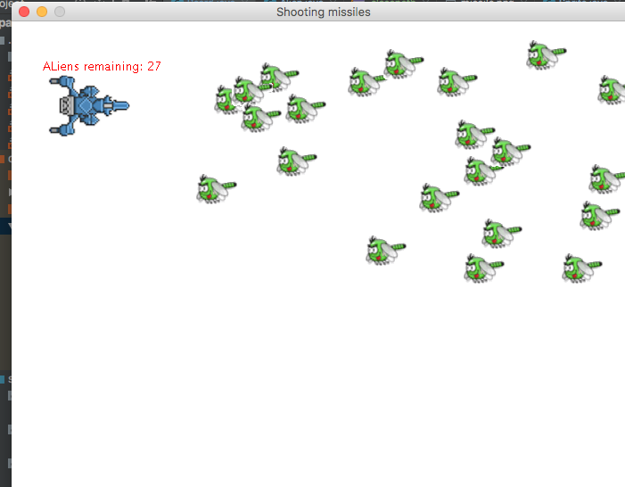

##SpaceInvaderClassic

 A basic game in java swing demonstrating oop principles and use of java 2D library. Use of basic collison detection for moving objects
(sprites).

  
 #### To-Do:
 <ol>
 <li>firing of missiles by aliens </li>
 <li>sounds</li>
 </ol>      

                                             
                                  
<h5>August 2, 2018</h5>
